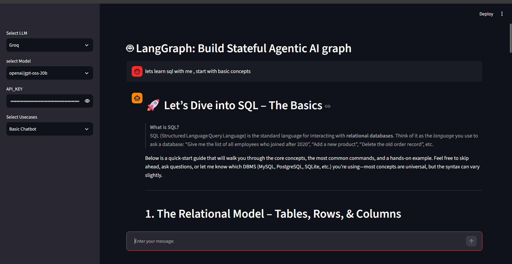
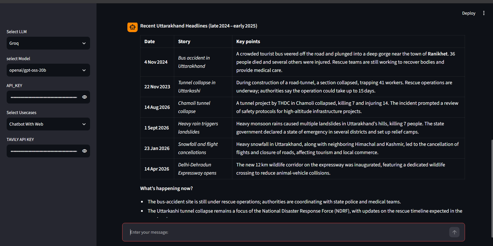

# ✅ 🤖 LangGraph Agentic AI: Stateful Multi-Tool Chatbot (Python + LangGraph + Groq)

## 📄 Project Overview

An Agentic AI application built using **LangGraph**, **LangChain**, **Groq**, **Tavily**, and **Streamlit** to demonstrate stateful AI workflows and tool-based reasoning.

This project includes **three AI use cases**: Basic LLM Chatbot, Web-enabled Tool Calling Chatbot, and AI News Explorer.

### 🎯 Main Project Goal
Build practical **stateful Agentic AI workflows** that can interact with LLMs, external tools, and real-time information.

---

## 🧰 Tech Stack

| Tool | Purpose |
|------|---------|
| **Python** | Application Development & Workflow Logic |
| **LangGraph** | Stateful AI Workflow & Graph Construction |
| **LangChain** | LLM & Tool Integration |
| **Groq** | LLM Inference |
| **Tavily** | Web Search & AI News Retrieval |
| **Streamlit** | Interactive User Interface |

---

## 📁 Project Components

| Component | Description |
|-----------|-------------|
| 💬 Basic Chatbot | Direct conversation with the Groq LLM |
| 🌐 Web Chatbot | Tool-based web search using Tavily |
| 📰 AI News | Fetches and summarizes recent AI news |
| 🔄 StateGraph | Manages state and workflow between nodes |

---

## 🧠 LangGraph Workflow

- Created separate graph workflows for each use case
- Used **StateGraph** for state management
- Added nodes for chatbot, tools, news retrieval, and summarization
- Used conditional routing for tool calling
- Connected **ToolNode** with the chatbot
- Used Tavily for external web search

---

## 💬 Basic LLM Chatbot

- Accepts user questions through Streamlit
- Sends messages to the selected Groq LLM
- Generates conversational responses
- Uses a simple LangGraph workflow

---

## 🌐 Chatbot With Tool Calling

- Uses **Tavily** as an external search tool
- LLM decides when web information is required
- LangGraph routes the request to the ToolNode
- Tool results are returned to the chatbot
- Generates a final response using retrieved information

---

## 📰 AI News Explorer

- Fetches recent AI-related news using Tavily
- Supports **Daily, Weekly, and Monthly** timeframes
- Processes retrieved news articles
- Uses the LLM to summarize the articles
- Saves generated summaries as Markdown files

---

## 📂 Generated News Reports

    AINews/
    ├── daily_summary.md
    └── weekly_summary.md

---

## 🔍 Key Agentic AI Concepts

Key concepts implemented:

- ✅ Stateful AI workflows
- ✅ LangGraph StateGraph
- ✅ Conditional routing
- ✅ LLM tool calling
- ✅ ToolNode integration
- ✅ External web search
- ✅ Multi-node workflows
- ✅ LLM-based summarization
- ✅ Streamlit-based interaction

---

## 💡 Project Highlights

1. Build modular Agentic AI workflows
2. Integrate external tools with LLMs
3. Route tasks dynamically using LangGraph
4. Retrieve and summarize real-time information
5. Create an interactive AI application using Streamlit

---

# Project Structure

- AINews/
  - daily_summary.md
  - weekly_summary.md
- Results/
  - Normal_llm_bot/
    - result_part_a.png
    - part_b.png
    - part_c.png
    - part_d.png
    - part_e.png
    - part_f.png
    - part_g.png
    - part_h.png
  - ai news/
    - ai_news.png
  - chatbot_with_tool_call/
    - final_ans.png
    - question_with_tool_call_start.png
- src/
  - langgraph_agentic_ai/
    - LLMS/
      - groqllm.py
    - graph/
      - graph_builder.py
    - nodes/
      - ai_news_node.py
      - basic_chatbot_node.py
      - chatbot_with_Tool_node.py
    - state/
      - state.py
    - tools/
      - search_tool.py
    - ui/
      - uiconfig.ini
      - uiconfigfile.py
      - streamlit/
        - display_result.py
        - loadui.py
    - main.py
- .gitignore
- app.py
- requirements.txt
- README.md

---

## 🧠 What I Learned

- Building stateful workflows using LangGraph
- Integrating LLMs with external tools
- Implementing tool calling and conditional routing
- Working with real-time web search
- Building modular Agentic AI applications

---

## ⭐ Future Improvements

- [ ] Add persistent conversation memory
- [ ] Add RAG-based document search
- [ ] Add more external tools
- [ ] Add LangGraph checkpointing
- [ ] Deploy the application

---

## 📫 Connect

Feel free to reach out for collaboration or feedback!

---

⭐ **If you found this project useful, give it a star!** ⭐
